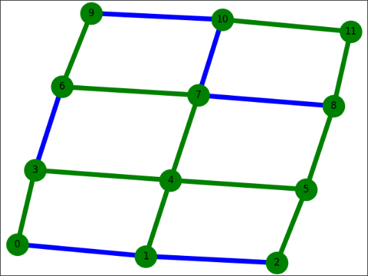
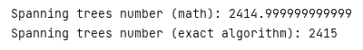
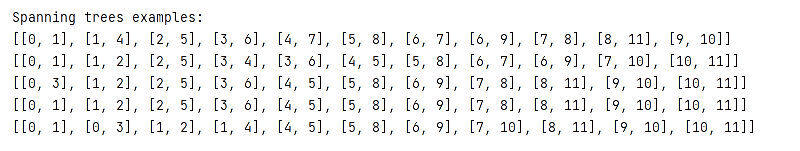
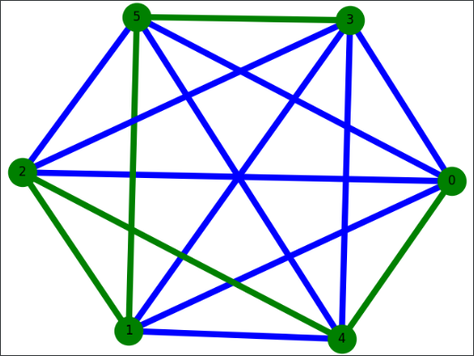
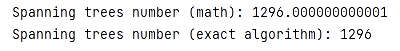
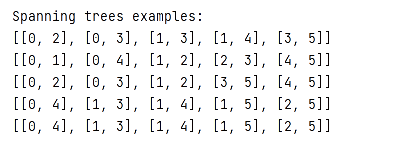

# Spanning trees in the graph

## Table of contents
* [General info](#general-info)
* [Usage](#usage)

## General info
This project includes an algorithm searching for all spanning trees in the graph and their total number.
	
## Usage
### Graph - grid (n=2, m=3)

### Graph - complete (n=6)

